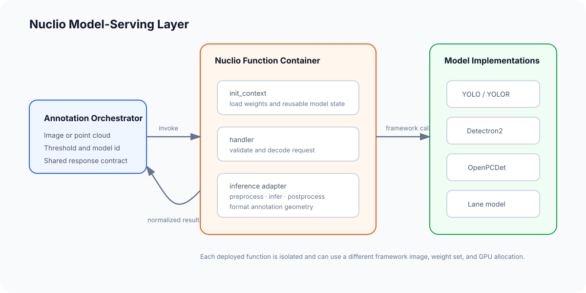
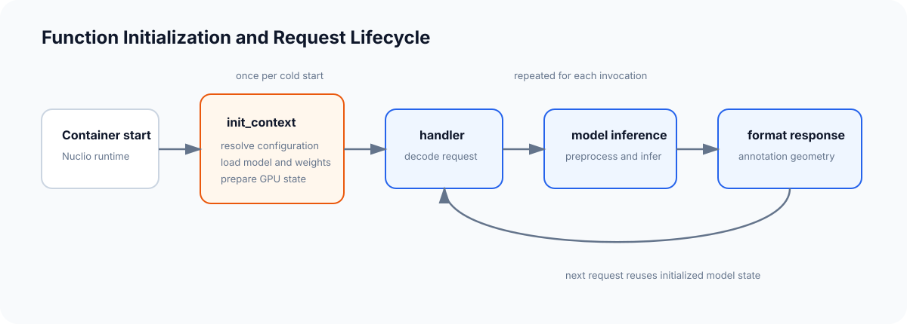

# Vision Function Foundry

A collection of GPU-backed computer vision functions packaged for independent deployment with Nuclio. Each function owns model initialization, preprocessing, inference, postprocessing, and conversion to a shared annotation-oriented response contract.

The companion [auto-annotation orchestrator](https://github.com/RocketWill/lkdi-auto-anno) discovers these functions, invokes them for individual frames or queued tasks, and writes normalized results back to an annotation platform.



## Why this layer exists

The annotation workflow should not need to understand how a particular framework loads weights, prepares tensors, runs GPU inference, or represents geometry. Nuclio provides the deployment seam; each function hides the model-specific implementation behind the same request and response shape.

This keeps three concerns separate:

- The annotation platform owns tasks, media, labels, and saved annotations.
- The orchestrator owns job execution, progress, label mapping, and result write-back.
- This repository owns model serving and model-specific output conversion.

## Function inventory

| Function | Framework | Input | Output | Reference data/domain |
| --- | --- | --- | --- | --- |
| YOLOv5 COCO | PyTorch / Ultralytics | Image | 2D boxes | COCO |
| YOLOv5 BDD | PyTorch / Ultralytics | Image | 2D boxes | Driving scenes |
| YOLOv5 wheel | PyTorch / Ultralytics | Image | Rectangles and ellipses | Vehicle geometry |
| YOLOR signs | PyTorch / YOLOR | Image | 2D boxes | Road signs |
| Mask R-CNN COCO | PyTorch / Detectron2 | Image | Instance shapes | COCO |
| MViTv2 COCO | PyTorch / Detectron2 | Image | 2D boxes | COCO |
| Two-stage cuboid workflow | YOLOv5 + Detectron2 | Image | Structured cuboid points | Vehicle geometry |
| Lane detection | PyTorch / LaneATT-style pipeline | Image | Polylines | TuSimple |
| OpenPCDet KITTI | PyTorch / OpenPCDet | Point cloud | 3D cuboids | KITTI |

The repository does not include model weights. Several deployment definitions also reference legacy base images and must be adapted to an available CUDA environment before deployment.

## Function contract

Every function exposes a Nuclio Python handler through `main:handler` and loads its model once during `init_context`.

### Image request

```json
{
  "image": "<base64-encoded image>",
  "threshold": 0.6
}
```

### Detection response

```json
{
  "code": 200,
  "message": "ok",
  "result": [
    {
      "label": "car",
      "confidence": 0.91,
      "points": [120.4, 84.2, 406.8, 310.1],
      "type": "rectangle"
    }
  ]
}
```

Point-cloud, lane, segmentation, and cuboid functions keep the same response envelope while returning geometry appropriate to their annotation type.

## Function lifecycle



1. Nuclio creates the function container.
2. `init_context` resolves configuration, loads weights, prepares the device, and stores reusable model state on the context.
3. The handler validates the request and decodes the image or point cloud.
4. Framework-specific inference and postprocessing run on the configured device.
5. A formatter converts predictions to the shared annotation response.

Keeping model initialization outside the request handler avoids loading weights for every invocation.

## Function structure

Most function directories follow the same layout:

```text
function-name/
├── function.yaml       # Nuclio metadata, runtime, resources, and mounts
├── main.py             # init_context and request handler
├── infer.py            # model loading and inference
├── tools.py            # response formatting where required
├── deploy-example.sh   # example nuctl deployment command
└── logger_cfg.cfg
```

OpenPCDet and Detectron2 functions additionally include framework configuration files required by their inference implementations.

## Deployment

### Prerequisites

- Docker with NVIDIA Container Toolkit
- A CUDA-compatible GPU and driver
- Nuclio dashboard and `nuctl`
- A compatible framework base image
- Model weights for the selected function

Create a Nuclio project:

```bash
nuctl create project annotation-models
```

Then enter a function directory, review `function.yaml` and `deploy-example.sh`, and update:

- the project name;
- the CUDA device allocation;
- base and target image names;
- model and weight mounts;
- framework source paths.

Deploy with the adjusted example command:

```bash
bash deploy-example.sh
```

The checked-in `function.yaml` files target Python 3.8 and request one NVIDIA GPU. Their image references document the original environment and are not guaranteed to remain available.

## Adding another model

1. Copy the nearest function by input and output type.
2. Implement model loading in `init_context`.
3. Keep framework-specific preprocessing and inference inside `infer.py`.
4. Convert predictions to the shared response envelope.
5. Declare labels, framework, dimension, resources, and mounts in `function.yaml`.
6. Test cold initialization separately from repeated handler calls.

The important interface is the annotation contract, not the framework used behind it.

## Verification scope

All Python files are checked for syntax, and all deployment scripts are checked with `bash -n`. Full inference verification requires the matching framework source, base image, model weights, CUDA runtime, and sample data for each function.

The functions should therefore be treated as deployment references until their external assets are supplied and the selected function is tested in a current Nuclio environment.

## Licensing and upstream projects

The root [LICENSE](LICENSE) applies to the project-owned integration code. Framework-derived code and configuration retain their upstream terms. See [THIRD_PARTY_NOTICES.md](THIRD_PARTY_NOTICES.md) before redistributing or building images from this repository.
